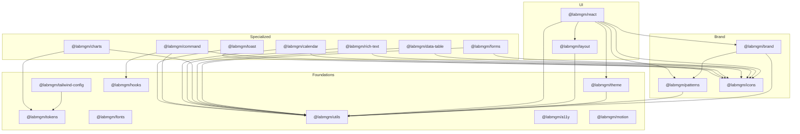

<div align="center">

# @labmgm/* — MGM Laboratory Design System

A complete, opinionated React design system for MGM Laboratory.<br/>
Ship product UIs and websites with brand-correct components, patterns, icons, fonts, and tokens — **without ever installing a second UI library.**

[](https://www.npmjs.com/package/@labmgm/react)
[](./LICENSE)
[](https://github.com/MGM-Laboratory/ds-design-system/actions)
[](https://mgm-laboratory.github.io/ds-design-system/)

[**📚 Storybook**](https://mgm-laboratory.github.io/ds-design-system/) · [**📦 npm**](https://www.npmjs.com/org/labmgm) · [**🎨 Design system spec**](./DESIGN_SYSTEM.md) · [**🤝 Contributing**](./CONTRIBUTING.md)

</div>

---

## ✨ Highlights

- 🎯 **One install, everything works.** Radix UI, Lucide, Framer Motion, React Hook Form, Zod, Tiptap, TanStack Table — bundled as direct dependencies of the relevant `@labmgm/*` package. No second dependency to install.
- 🧱 **20 packages, ~70 components, 80 SVG patterns.** Buttons, dialogs, forms, charts, calendars, rich text, command palettes — covered.
- 🎨 **Brand-locked tokens.** Closed 4-color palette, two-font type stack, soft shadows, 2.25 stroke icons. Faithful to `DESIGN_SYSTEM.md`.
- ♿ **Accessible by default.** Radix primitives, focus rings, ARIA, `prefers-reduced-motion`, axe-core in CI.
- 🌗 **Surface scoping.** Drop a `<Surface tone="inverse">` and children flip to dark — no per-component dark variant needed.
- 🔌 **Two styling paths.** Extend the Tailwind preset, or import the pre-compiled stylesheet. Either works.
- 📐 **Strict types.** Every variant, every prop. CVA + TypeScript surfaces typos at compile time.

> "The pattern is **the spice, not the meal**." — `DESIGN_SYSTEM.md` §1

---

## 📦 Packages

All packages live under the `@labmgm` npm org and are published from this monorepo via Changesets.

> Current published version: **`0.1.2`** ([changelog](./CHANGELOG.md))

<details open>
<summary><b>Foundations</b> — tokens, theme, fonts, utilities</summary>

| Package | Size (gzip) | Purpose |
|---|---|---|
| [`@labmgm/tokens`](./packages/tokens) | ~2 KB | Single source of truth: colors, type scale, shadows, radii, motion. Ships CSS variables + TS objects + JSON. |
| [`@labmgm/tailwind-config`](./packages/tailwind-config) | ~1 KB | Tailwind preset wiring every token + custom keyframes / animations. |
| [`@labmgm/fonts`](./packages/fonts) | ~1 KB | `next/font` loaders for Bricolage Grotesque, Geist, Geist Mono. Raw CSS variant for non-Next stacks. |
| [`@labmgm/utils`](./packages/utils) | ~3 KB | `cn()` (Tailwind-aware merge with MGM tokens registered), formatters, polymorphic helpers. |
| [`@labmgm/theme`](./packages/theme) | ~1 KB | `<ThemeProvider>`, `<Surface tone="default \| muted \| inverse">`, `useSurface()`. |
| [`@labmgm/hooks`](./packages/hooks) | ~2 KB | `useMediaQuery`, `useDebounce`, `useLocalStorage`, `useClickOutside`, `useReducedMotion`, … |
| [`@labmgm/a11y`](./packages/a11y) | ~1 KB | `<VisuallyHidden>`, `<FocusTrap>`, `useFocusVisible`, live-region announcer. |
| [`@labmgm/motion`](./packages/motion) | (peer) | Framer Motion + presets bound to MGM durations / easings. |

</details>

<details open>
<summary><b>Brand</b> — logo, patterns, icons</summary>

| Package | Size (gzip) | Purpose |
|---|---|---|
| [`@labmgm/brand`](./packages/brand) | ~3 KB | `<Logo>`, `<Wordmark>`, `<ShapeSignature>`, `<FooterStrip>`. |
| [`@labmgm/patterns`](./packages/patterns) | ~28 KB | 80-tile Bauhaus pattern catalog + `<PatternGrid>` composer (deterministic, no-adjacent-repeat). |
| [`@labmgm/icons`](./packages/icons) | (peer) | Lucide pre-configured with the MGM 2.25 stroke width + 16/20/24 size tokens. |

</details>

<details open>
<summary><b>Components</b> — UI primitives</summary>

| Package | Size (gzip) | Purpose |
|---|---|---|
| [`@labmgm/react`](./packages/react) | ~28 KB | The core library. Buttons, cards, dialogs, navigation, feedback, media, ~70 primitives. |
| [`@labmgm/layout`](./packages/layout) | ~3 KB | `<Container>`, `<Section>`, `<Stack>`, `<HStack>`, `<VStack>`, `<Grid>`, `<Flex>`, `<Box>`, `<Center>`, `<Spacer>`, `<AspectRatio>`, `<Divider>`. |

</details>

<details open>
<summary><b>Specialized</b> — forms, data, content</summary>

| Package | Size (gzip) | Purpose |
|---|---|---|
| [`@labmgm/forms`](./packages/forms) | ~10 KB | React Hook Form + Zod, `<Field>`, `<Wizard>`, every input primitive. |
| [`@labmgm/data-table`](./packages/data-table) | ~2 KB | TanStack Table v8 + MGM styling. |
| [`@labmgm/charts`](./packages/charts) | ~4 KB | Recharts wrappers — Bar, Line, Area, Pie, Donut, Sparkline. |
| [`@labmgm/rich-text`](./packages/rich-text) | ~4 KB | Tiptap editor + renderer with StarterKit, Link, Image, Code, Mention, Table, YouTube. |
| [`@labmgm/calendar`](./packages/calendar) | ~2 KB | `<Calendar>`, `<DatePicker>`, `<DateRangePicker>`, `<TimePicker>` powered by react-day-picker. |
| [`@labmgm/command`](./packages/command) | ~3 KB | ⌘K command palette built on cmdk. |
| [`@labmgm/toast`](./packages/toast) | ~1 KB | Sonner-wrapped toasts with MGM tones. |

</details>

---

## 🚀 Quick Start

### 1. Install

```bash
pnpm add @labmgm/react @labmgm/tokens @labmgm/tailwind-config @labmgm/fonts
```

> Using npm or yarn? Both work — replace `pnpm add` with `npm install` or `yarn add`.

### 2. Pick a styling path

<table>
<tr>
<td>

**Option A — Tailwind preset** *(recommended)*

```ts
// tailwind.config.ts
import preset from '@labmgm/tailwind-config';

export default {
  presets: [preset],
  content: [
    './src/**/*.{ts,tsx}',
    './node_modules/@labmgm/**/dist/**/*.{js,mjs}',
  ],
};
```

</td>
<td>

**Option B — Pre-compiled CSS**

```ts
// in your root layout
import '@labmgm/tokens/tokens.css';
import '@labmgm/react/styles.css';
```

</td>
</tr>
</table>

### 3. Wire fonts (Next.js)

```tsx
// src/app/layout.tsx
import '@labmgm/tokens/tokens.css';
import { bricolageGrotesque, geist, geistMono } from '@labmgm/fonts/next';
import { ThemeProvider } from '@labmgm/theme';

export default function RootLayout({ children }: { children: React.ReactNode }) {
  return (
    <html
      lang="en"
      className={`${bricolageGrotesque.variable} ${geist.variable} ${geistMono.variable}`}
    >
      <body>
        <ThemeProvider>{children}</ThemeProvider>
      </body>
    </html>
  );
}
```

### 4. Ship a page

```tsx
import { Container, Section, Stack } from '@labmgm/react';
import { Button, Card, CardHeader, CardTitle, CardContent } from '@labmgm/react';

export default function Home() {
  return (
    <Section padding="lg">
      <Container>
        <Stack gap={6}>
          <h1 className="text-display-lg">
            Build the <span className="text-brand-red">loud</span> internet.
          </h1>
          <Card>
            <CardHeader>
              <CardTitle>Cards out of the box</CardTitle>
            </CardHeader>
            <CardContent>
              No second UI library required. Just <code>@labmgm/react</code>.
            </CardContent>
          </Card>
          <Button>Get started</Button>
        </Stack>
      </Container>
    </Section>
  );
}
```

That's it. 🎉

---

## 📖 Tutorial: build a "publish asset" flow

Let's wire a complete multi-step form using **only `@labmgm/*` packages**. The flow:

1. Hero with brand pattern
2. Wizard with three steps (Basics / Files / Review)
3. Validation via Zod + React Hook Form
4. Toast on success

### Step 1 — Hero with a pattern accent

```tsx
import { Container, Section, Stack } from '@labmgm/react';
import { PatternBanner } from '@labmgm/patterns';

function Hero() {
  return (
    <Section tone="muted" padding="lg">
      <Container>
        <Stack gap={6}>
          <span className="text-eyebrow uppercase text-ink-3">Publish</span>
          <h1 className="text-display-xl">Add a new asset.</h1>
          <p className="max-w-prose text-body-lg text-ink-2">
            Four steps, all validated, brand-correct.
          </p>
          <PatternBanner rows={2} cols={6} tileSize={56} seed="publish-hero" />
        </Stack>
      </Container>
    </Section>
  );
}
```

### Step 2 — Wizard with steps

```tsx
import { Wizard, WizardStep, StepRail, useWizard } from '@labmgm/forms';
import { Button, Card, CardHeader, CardTitle, CardContent } from '@labmgm/react';

function Publish() {
  return (
    <Container>
      <Card>
        <CardHeader>
          <CardTitle>New asset</CardTitle>
        </CardHeader>
        <CardContent>
          <Wizard defaultCurrent={0}>
            <WizardStep>
              <Step title="Basics" />
            </WizardStep>
            <WizardStep>
              <Step title="Files" />
            </WizardStep>
            <WizardStep>
              <Step title="Review" />
            </WizardStep>
          </Wizard>
        </CardContent>
      </Card>
    </Container>
  );
}

function Step({ title }: { title: string }) {
  const w = useWizard();
  return (
    <div className="grid grid-cols-1 gap-6 sm:grid-cols-[200px_1fr]">
      <StepRail
        navigable
        steps={[
          { title: 'Basics', description: 'Name & category' },
          { title: 'Files', description: 'Upload assets' },
          { title: 'Review', description: 'Confirm' },
        ]}
      />
      <Stack gap={4}>
        <h2 className="text-h2">{title}</h2>
        <p className="text-body text-ink-2">Step {w.current + 1} of {w.count}</p>
        <div className="flex justify-between">
          <Button variant="ghost" onClick={w.prev} disabled={w.isFirst}>Back</Button>
          <Button onClick={w.next} disabled={w.isLast}>
            {w.isLast ? 'Finish' : 'Next'}
          </Button>
        </div>
      </Stack>
    </Container>
  );
}
```

### Step 3 — Validated fields

```tsx
import {
  Form, FormProvider, useMgmForm,
  Field, Input, Textarea, Select, TagInput,
} from '@labmgm/forms';
import { z, slugSchema } from '@labmgm/forms/schemas';
import { Button } from '@labmgm/react';
import { toast } from '@labmgm/toast';

const schema = z.object({
  name: z.string().min(2),
  slug: slugSchema,
  category: z.string().min(1),
  description: z.string().max(500),
  tags: z.array(z.string()).min(1),
});

function BasicsStep() {
  const form = useMgmForm(schema, {
    defaultValues: { name: '', slug: '', category: '', description: '', tags: [] },
  });
  return (
    <FormProvider {...form}>
      <Form
        onSubmit={form.handleSubmit((v) => toast.success(`Saved ${v.name}`))}
        className="space-y-4"
      >
        <Field label="Asset name" required error={form.formState.errors.name?.message}>
          <Input {...form.register('name')} />
        </Field>
        <Field label="URL slug" required help="lowercase-with-hyphens" error={form.formState.errors.slug?.message}>
          <Input {...form.register('slug')} />
        </Field>
        <Field label="Category" required error={form.formState.errors.category?.message}>
          <Select
            options={[
              { value: 'env', label: 'Environment' },
              { value: 'char', label: 'Character' },
              { value: 'prop', label: 'Prop' },
            ]}
            placeholder="Pick a category"
            onChange={(v) => form.setValue('category', v)}
          />
        </Field>
        <Field label="Description">
          <Textarea {...form.register('description')} />
        </Field>
        <Field label="Tags" required>
          <TagInput onChange={(v) => form.setValue('tags', v)} />
        </Field>
        <Button type="submit" fullWidth>Continue</Button>
      </Form>
    </FormProvider>
  );
}
```

### Step 4 — Files dropzone

```tsx
import { FileDropzone } from '@labmgm/forms';
import { toast } from '@labmgm/toast';

function FilesStep() {
  return (
    <FileDropzone
      onFiles={(files) => toast.success(`Selected ${files.length} file(s)`)}
      accept={['.zip', '.fbx', '.glb']}
      maxSize={500 * 1024 * 1024}
    />
  );
}
```

### Step 5 — Mount the toaster

```tsx
// somewhere near your root
import { Toaster } from '@labmgm/toast';

<Toaster />
```

**That's the entire flow** — five files, no third-party UI dependencies, fully validated, brand-correct.

> Browse the **Forms** stories in [Storybook](https://mgm-laboratory.github.io/ds-design-system/) to see every input live with its props.

---

## 🎨 Design Tokens

The full token spec lives in [`DESIGN_SYSTEM.md`](./DESIGN_SYSTEM.md). At a glance:

### Color palette (closed)

| Token | Hex | Use |
|---|---|---|
| `brand-blue` | <code>#3a6dc5</code> | Primary action, links |
| `brand-yellow` | <code>#f7bf33</code> | Highlight, attention, warmth |
| `brand-red` | <code>#f94141</code> | Emphasis, energy, error |
| `brand-green` | <code>#0f8657</code> | Success, positive states |
| `bg` / `surface` | <code>#ffffff</code> | Page / panel surface |
| `surface-muted` | <code>#f7f7f5</code> | Off-white zoning |
| `surface-inverse` | <code>#0e1116</code> | Dark sections |
| `ink` / `ink-2/3/4` | <code>#0e1116</code> → <code>#9aa1ad</code> | Text hierarchy |

> No purple, teal, pink, or orange. **The palette is closed.**

### Typography

| Token | Size | Use |
|---|---|---|
| `display-2xl` | 72px | Marketing hero |
| `display-xl` | 56px | Sub-hero |
| `display-lg` | 40px | Page H1 in product |
| `h1` – `h4` | 32 / 24 / 20 / 17px | Section / subsection / card / inline |
| `body-lg` / `body` / `body-sm` | 18 / 16 / 15px | Body copy |
| `caption` | 13px | Labels, helper, table heads |
| `mono` | 14px | Code, technical numerals |
| `eyebrow` | 12px | All-caps section labels |

Fonts: **Bricolage Grotesque** (display), **Geist** (UI), **Geist Mono** (code). No substitutes.

### Motion

```
--dur-1: 120ms   ease-out-soft     cubic-bezier(0.22, 1, 0.36, 1)
--dur-2: 200ms   ease-in-out-soft  cubic-bezier(0.65, 0, 0.35, 1)
--dur-3: 320ms   ease-spring       cubic-bezier(0.34, 1.56, 0.64, 1)
--dur-4: 520ms
--dur-5: 800ms
```

All motion respects `prefers-reduced-motion: reduce`.

---

## 🌗 Surfaces & Inverse Scopes

No full dark mode. Instead, scope dark sections with `<Surface tone="inverse">`:

```tsx
import { Surface } from '@labmgm/theme';

<Surface tone="inverse" as="section" className="py-24">
  <h2 className="text-display-lg">High-contrast section.</h2>
  <p className="text-body text-ink-2">
    Children using contextual tokens (text-ink, border-line, …) flip
    automatically. Brand colors stay constant.
  </p>
</Surface>
```

Cards, dialogs, popovers, and other self-contained surfaces reset back to `data-surface="default"` so they always render correctly even when nested inside a dark section.

---

## 🧩 Component Catalog

<details>
<summary><b>Buttons & actions</b> (8)</summary>

`Button` · `IconButton` · `ButtonGroup` · `ToggleButton` · `ToggleButtonGroup` · `Link` · `Kbd` · `CopyButton` · `BackButton`

</details>

<details>
<summary><b>Display</b> (13)</summary>

`Card` (+ Header/Title/Description/Content/Footer) · `Badge` · `Tag` · `Chip` · `Avatar` · `AvatarGroup` · `Stat` · `Empty` · `Skeleton` · `Spinner` · `Code` · `CodeBlock`

</details>

<details>
<summary><b>Overlays</b> (8)</summary>

`Dialog` · `AlertDialog` · `Drawer` (4 sides) · `Popover` · `HoverCard` · `Tooltip` · `DropdownMenu` · `ContextMenu`

</details>

<details>
<summary><b>Navigation</b> (6)</summary>

`Tabs` · `Accordion` · `Breadcrumb` · `Pagination` · `Stepper` · `Navbar`

</details>

<details>
<summary><b>Feedback</b> (5)</summary>

`Alert` · `Banner` · `Progress` · `ProgressCircle` · `Callout` · `Toast`

</details>

<details>
<summary><b>Forms</b> (18)</summary>

`Input` · `Textarea` · `SearchInput` · `NumberInput` · `PinInput` · `Checkbox` · `CheckboxGroup` · `Radio` · `RadioGroup` · `Switch` · `Slider` · `Select` · `Combobox` · `MultiSelect` · `TagInput` · `FileDropzone` · `ColorPicker` · `Wizard` + `StepRail`

</details>

<details>
<summary><b>Data display</b> (5)</summary>

`DataTable` · `List` · `DescriptionList` · `Timeline` · `Separator`

</details>

<details>
<summary><b>Media</b> (2)</summary>

`Image` · `Carousel`

</details>

<details>
<summary><b>Layout</b> (12)</summary>

`Container` · `Section` · `Stack` · `HStack` · `VStack` · `Grid` · `Flex` · `Box` · `Center` · `Spacer` · `AspectRatio` · `Divider`

</details>

<details>
<summary><b>Brand</b> (4)</summary>

`Logo` · `Wordmark` · `ShapeSignature` · `FooterStrip`

</details>

<details>
<summary><b>Patterns</b> (8)</summary>

`PatternGrid` · `PatternTile` · `PatternCorner` · `PatternBanner` · `PatternStrip` · `PatternDado` · `PatternPyramid` · `PatternTriangle`

</details>

> **166 stories across 40 categories** are live at [mgm-laboratory.github.io/ds-design-system](https://mgm-laboratory.github.io/ds-design-system/).

---

## 🏗️ Repository Architecture



> Tooling: **pnpm workspaces** · **Turborepo** · **tsup** (dual ESM + CJS) · **Changesets**.<br/>
> Style: **Tailwind 3** preset (`@labmgm/tailwind-config`) + per-package compiled CSS (`@labmgm/react/styles.css`).

---

## 🛠️ Local Development

```bash
# Prereqs: Node 20+, pnpm 9+
nvm use
pnpm install
pnpm build                                # build every package
pnpm dev                                  # watch mode across the monorepo
pnpm --filter @labmgm/playground dev      # sandbox at http://localhost:3000
pnpm --filter storybook storybook         # Storybook at http://localhost:6006
pnpm --filter docs dev                    # docs site at http://localhost:3001
```

### Useful scripts

| Command | What it does |
|---|---|
| `pnpm build` | Build every package via Turbo |
| `pnpm lint` | ESLint flat config across the workspace |
| `pnpm typecheck` | `tsc --noEmit` everywhere |
| `pnpm test` | Vitest across the workspace (with `--passWithNoTests`) |
| `pnpm format` | Prettier across all files |
| `pnpm changeset` | Add a release note before opening a PR |
| `pnpm release` | Build + publish (only run by CI) |

> CI runs the same `lint + typecheck + test + build` matrix on every PR — see [`.github/workflows/ci.yml`](./.github/workflows/ci.yml).

---

## 🚢 Release Process

We use **Changesets** for independent per-package versioning.

```bash
# After making changes
pnpm changeset            # prompts for affected packages + bump type
git add .changeset
git commit -m "feat: ..."
gh pr create              # opens the PR
```

Once the PR merges to `main`:

1. The **Release** workflow opens (or updates) a `chore: version packages` PR with all pending bumps.
2. Merging that PR triggers `changeset publish` → packages go live on npm under `@labmgm`.
3. The **Docs** workflow rebuilds and redeploys Storybook to GitHub Pages.

> npm provenance is supported and will be re-enabled once the `@labmgm` npm org is configured as a trusted publisher for this repo.

---

## ♿ Accessibility

- Every interactive primitive is a Radix UI primitive (WCAG 2.1 AA out of the box).
- Focus rings: 2px blue at 2px offset on `:focus-visible`.
- All animations honor `prefers-reduced-motion: reduce` (collapsed to 0.001ms in `@labmgm/tokens/tokens.css`).
- axe-core runs against every Storybook story via the a11y addon.
- Color rules from `DESIGN_SYSTEM.md` (red never as body text on white, yellow never carries text on white) are enforced as variant-level constraints in the components that own those colors.

> If you find an accessibility issue, please [open one](https://github.com/MGM-Laboratory/ds-design-system/issues/new?labels=a11y).

---

## 🧪 Testing your integration

The fastest sanity check is the integration sandbox in this repo:

```bash
pnpm --filter @labmgm/playground dev
```

The sandbox imports every published package and uses every primitive. If your project builds against the same workspace versions and the sandbox builds, you're good.

For external projects, add this single line to a fresh Next.js 15 app and confirm it boots:

```tsx
import { Button } from '@labmgm/react';

export default function Test() {
  return <Button>It works</Button>;
}
```

---

## 🤖 For AI assistants & code agents

If you're using Claude Code, Cursor, or another AI assistant in this repo:

- The agent-context file [`CLAUDE.md`](./CLAUDE.md) describes the architecture, conventions, and gotchas.
- The design spec [`DESIGN_SYSTEM.md`](./DESIGN_SYSTEM.md) is the canonical source of brand truth — don't paraphrase it, link to it.
- The component-level CVA variants are typed; let TypeScript drive choices.

---

## 🤝 Contributing

We love contributions. Open an issue, send a PR, or jump into [`CONTRIBUTING.md`](./CONTRIBUTING.md) for the full guide.

**Quick recipe:**

```bash
git checkout -b feat/my-thing
# ... make your change ...
pnpm changeset            # describe what changed
git push -u origin feat/my-thing
gh pr create
```

CI will run automatically. Once green and reviewed, merge — the version PR + publish happens for you.

---

## 📚 Further reading

- [`DESIGN_SYSTEM.md`](./DESIGN_SYSTEM.md) — the brand bible (colors, type, motion, iconography rules)
- [`CONTRIBUTING.md`](./CONTRIBUTING.md) — workflow, coding standards, release process
- [`CHANGELOG.md`](./CHANGELOG.md) — high-level monorepo history
- [`CLAUDE.md`](./CLAUDE.md) — AI assistant context
- [Storybook](https://mgm-laboratory.github.io/ds-design-system/) — every component, every variant, every state
- [npm org](https://www.npmjs.com/org/labmgm) — installable packages
- [Issues](https://github.com/MGM-Laboratory/ds-design-system/issues) — bugs and feature requests

---

<div align="center">

Built with care by the MGM Laboratory team.<br/>
**MIT** © MGM Laboratory · [Report an issue](https://github.com/MGM-Laboratory/ds-design-system/issues) · [Suggest a feature](https://github.com/MGM-Laboratory/ds-design-system/issues/new?labels=enhancement)

</div>
